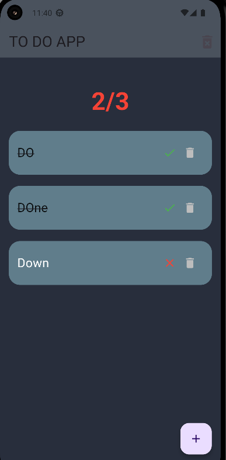
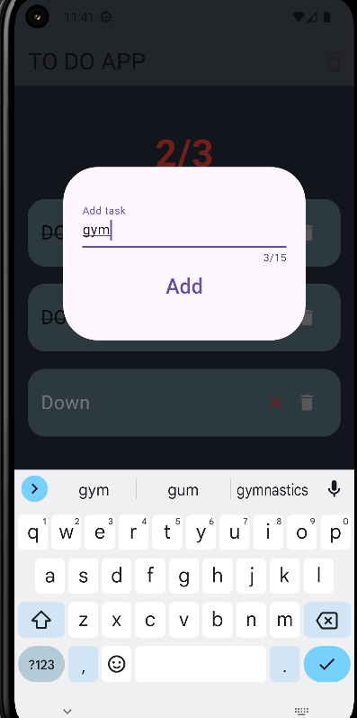
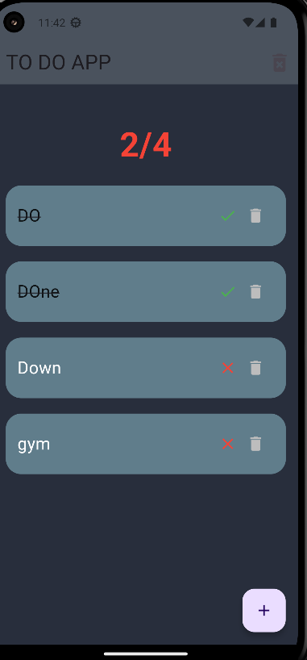
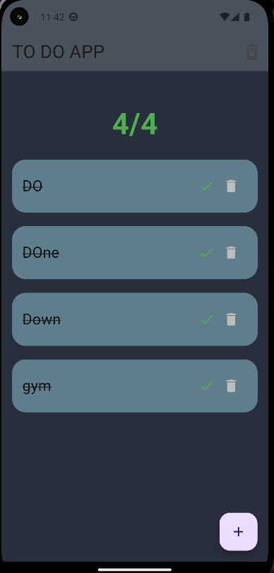

---

# To-Do App

A Flutter-based to-do application to manage tasks with features such as adding, editing, deleting, and tracking task completion. The app provides a simple and intuitive interface for users to manage their daily tasks.

## Features

- **Add Tasks**: Easily add new tasks using a floating action button.
- **Mark Tasks as Complete**: Tap on a task to toggle its completion status.
- **Delete Tasks**: Remove individual tasks or clear all tasks at once.
- **Task Counter**: Display the number of tasks completed vs. total tasks.
- **Responsive Design**: The app is designed to work seamlessly across different screen sizes.

## Screenshots

|  |  |  |  |
|-------------------------------------------|-------------------------------------|------------------------------------------|-------------------------------------|
| **Main Screen** <br> Shows the list of tasks. | **Add Task** <br> Where users can input new tasks. | **Task Added** <br> Confirmation after a new task is added. | **All Done** <br> Completed status screen. |


## Installation

### Prerequisites
- **Flutter**: Ensure that you have Flutter installed on your system. If not, follow the installation guide [here](https://flutter.dev/docs/get-started/install).
- **Dart**: Dart comes with Flutter, so installing Flutter will install Dart as well.

### Steps to Run

1. Clone the repository:

   ```bash
   git clone https://github.com/yourusername/todoapp.git
   ```

2. Navigate to the project directory:

   ```bash
   cd todoapp
   ```

3. Install the necessary dependencies:

   ```bash
   flutter pub get
   ```

4. Run the app:

   ```bash
   flutter run
   ```

## Usage

Once the app is running, you can:
- Add tasks by clicking the **+** button in the bottom-right corner.
- Tap on a task to mark it as completed or incomplete.
- Delete individual tasks by clicking the delete icon.
- Clear all tasks by clicking the **delete forever** icon in the AppBar.

## App Structure

- **MyApp**: The entry point of the application where the `TodoApp` widget is initialized.
- **TodoApp**: The main widget responsible for managing and displaying the list of tasks.
- **Tasks**: A model class representing a task with a title and completion status.
- **TodoCard**: A widget to display each task with options to mark as complete/incomplete and delete the task.
- **MyCounter**: Displays the number of completed tasks vs. total tasks.

## Code Highlights

### Task Management

- Tasks are stored in a simple list called `todotasks`.
- The app allows adding, deleting, and marking tasks as completed.
  
```dart
List<Tasks> todotasks = [
  Tasks(title: "Sample Task", status: false),
];

void addTask() {
  setState(() {
    todotasks.add(Tasks(title: mycontroller.text, status: false));
  });
}

void toggleTaskStatus(int taskIndex) {
  setState(() {
    todotasks[taskIndex].status = !todotasks[taskIndex].status;
  });
}
```

### UI Components

- **FloatingActionButton**: Triggers the addition of new tasks.
- **TodoCard**: Displays task details and allows interaction (completion and deletion).
  
```dart
FloatingActionButton(
  onPressed: () {
    showDialog(
      context: context,
      builder: (BuildContext context) {
        return Dialog(
          shape: RoundedRectangleBorder(
              borderRadius: BorderRadius.circular(40)),
          child: Container(
            padding: EdgeInsets.all(22),
            child: Column(
              mainAxisAlignment: MainAxisAlignment.center,
              children: [
                TextField(
                  controller: mycontroller,
                  decoration: InputDecoration(label: Text("Add task")),
                ),
                TextButton(
                  onPressed: () {
                    addTask();
                    Navigator.pop(context);
                  },
                  child: Text("Add", style: TextStyle(fontSize: 24)),
                ),
              ],
            ),
          ),
        );
      },
    );
  },
  child: Icon(Icons.add),
)
```

### Counter Widget

- **MyCounter**: Displays the total number of tasks and the number of tasks completed.

```dart
class MyCounter extends StatelessWidget {
  final int allcompleted;
  final int alltodos;

  MyCounter({required this.allcompleted, required this.alltodos});

  @override
  Widget build(BuildContext context) {
    return Padding(
      padding: const EdgeInsets.only(top: 27.0),
      child: Text(
        "$allcompleted/$alltodos",
        style: TextStyle(
          fontSize: 44,
          fontWeight: FontWeight.bold,
          color: allcompleted == alltodos ? Colors.green : Colors.red,
        ),
      ),
    );
  }
}
```

## Contributing

Contributions are welcome! If you have any suggestions, bug reports, or feature requests, please open an issue or submit a pull request.

1. **Fork the repository**.
2. **Create a new branch**:
   ```bash
   git checkout -b feature/your-feature-name
   ```
3. **Commit your changes**:
   ```bash
   git commit -m 'Add some feature'
   ```
4. **Push to the branch**:
   ```bash
   git push origin feature/your-feature-name
   ```
5. **Open a pull request**.


